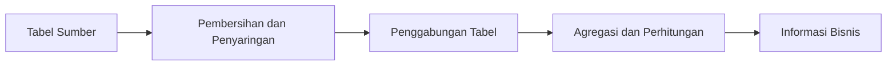

# Portofolio Analisis Data dengan SQL


Kumpulan lima proyek SQL yang saya selesaikan melalui jalur pembelajaran DQLab. Portofolio ini menunjukkan kemampuan mengolah data transaksi, menganalisis perilaku pelanggan, mengevaluasi kinerja penjualan, dan menerjemahkan pertanyaan bisnis menjadi kueri SQL yang terstruktur.

> **Catatan:** Proyek-proyek ini dikerjakan sebagai bagian dari pembelajaran terstruktur DQLab. Implementasi kueri dan penyelesaian latihan pada repository ini merupakan hasil pekerjaan saya, sedangkan materi, studi kasus, dan dataset tetap menjadi hak pemilik masing-masing. Dataset e-commerce disertakan untuk mendukung reproduksi analisis, sedangkan Google Dokumen dan notebook kerja tidak dipublikasikan.

## Daftar Isi

- [Ringkasan Portofolio](#ringkasan-portofolio)
- [Permasalahan](#permasalahan)
- [Target Pengguna](#target-pengguna)
- [Solusi](#solusi)
- [Detail Proyek](#detail-proyek)
- [Fitur Utama](#fitur-utama)
- [Tantangan dan Pembelajaran](#tantangan-dan-pembelajaran)
- [Dampak](#dampak)
- [Pilihan Teknologi](#pilihan-teknologi)
- [Struktur Repository](#struktur-repository)
- [Cara Menjalankan](#cara-menjalankan)
- [Sertifikat](#sertifikat)
- [Pengembangan Selanjutnya](#pengembangan-selanjutnya)
- [Penulis](#penulis)

## Ringkasan Portofolio

| No. | Proyek | Fokus Utama | Hasil |
|---:|---|---|---|
| 1 | [Fundamental SQL: Pengelompokan dan Penyaringan Agregat](01-fundamental-sql-group-by-and-having/project-fundamental-sql-group-by-and-having.sql) | `GROUP BY`, `HAVING`, agregasi, dan penggabungan tabel | Analisis penalti pelanggan dan perubahan layanan |
| 2 | [Tantangan Data Engineer dengan SQL](02-data-engineer-challenge-with-sql/data-engineer-challenge-with-sql.sql) | Produk, pelanggan, dan transaksi penjualan | Kumpulan kueri analisis DQLab Mart |
| 3 | [Analisis Kinerja Penjualan Ritel](03-retail-sales-performance/project-retail-sales-performance-report.sql) | Pendapatan, promosi, subkategori, dan status pesanan | Laporan performa penjualan DQLab Store |
| 4 | [Analisis Pelanggan Ritel B2B](04-b2b-retail-customer-analytics/project-data-analysis-for-b2b-retail-customer-analytics.sql) | Penjualan kuartalan, pelanggan baru, dan segmentasi | Laporan analitik pelanggan dan pertumbuhan transaksi |
| 5 | [Analisis Data E-Commerce](05-ecommerce-data-analysis/project-data-analysis-for-e-commerce-challenge.sql) | Pembeli, penjual, produk, nilai transaksi, dan waktu pembayaran | Tiga puluh kueri analisis transaksi e-commerce |

## Permasalahan

Data transaksi belum langsung menjawab pertanyaan bisnis. Data perlu dikelompokkan, digabungkan, disaring, dan diringkas agar dapat menunjukkan pola penjualan serta perilaku pelanggan.

Portofolio ini membahas beberapa permasalahan berikut:

- Menemukan pelanggan yang memenuhi kondisi agregat tertentu.
- Mengukur perubahan penjualan dan pendapatan antarperiode.
- Menilai efektivitas promosi dan kontribusi kategori produk.
- Mengidentifikasi pelanggan bernilai tinggi, pembeli aktif, dropshipper, dan reseller.
- Menemukan pengguna yang berperan sebagai pembeli sekaligus penjual.
- Menghitung durasi pembayaran dan tren transaksi per bulan.

## Target Pengguna

- **Analis data**, yang membutuhkan kueri terstruktur untuk menghasilkan informasi bisnis.
- **Analis bisnis**, yang ingin memahami penjualan, pelanggan, produk, dan promosi.
- **Data engineer pemula**, yang ingin mempelajari agregasi, penggabungan tabel, subkueri, dan fungsi tanggal.
- **Perekrut atau peninjau teknis**, yang ingin melihat kemampuan SQL saya melalui studi kasus nyata.

## Solusi

Saya menyusun kueri SQL yang mengubah tabel sumber menjadi ringkasan analitis melalui alur berikut:



Setiap file SQL dilengkapi komentar, petunjuk tabel, pembagian bagian analisis, indentasi yang konsisten, dan titik koma agar mudah dibaca serta dijalankan ulang.

## Detail Proyek

### 1. Fundamental SQL: Pengelompokan dan Penyaringan Agregat

**Permasalahan:** Data pelanggan, langganan, produk, dan tagihan perlu diringkas untuk menemukan kondisi tertentu pada tingkat pelanggan.

**Solusi:** Menggunakan `JOIN`, `GROUP BY`, fungsi agregat, `HAVING`, subkueri, dan `GROUP_CONCAT` untuk menganalisis penalti serta perubahan layanan pelanggan.

**Hasil:** Kumpulan latihan SQL dasar yang menunjukkan perbedaan penyaringan baris dan penyaringan hasil agregasi.

### 2. Tantangan Data Engineer dengan SQL

**Permasalahan:** Data produk dan transaksi DQLab Mart perlu dianalisis berdasarkan nama produk, kategori, harga, jumlah pembelian, dan karakteristik pelanggan.

**Solusi:** Menyusun kueri untuk menyaring produk, menggabungkan tabel transaksi, menghitung nilai penjualan, dan menghasilkan ringkasan pelanggan.

**Hasil:** Kumpulan kueri analisis produk dan transaksi menggunakan tabel `ms_produk`, `ms_pelanggan`, `tr_penjualan`, dan `tr_penjualan_detail`.

### 3. Analisis Kinerja Penjualan Ritel

**Permasalahan:** Kinerja DQLab Store perlu dievaluasi dari sisi pendapatan, subkategori produk, promosi, dan status pesanan.

**Solusi:** Menggunakan agregasi tahunan, pengelompokan subkategori, perhitungan persentase promosi, dan analisis jumlah pesanan.

**Hasil:** Laporan SQL yang merangkum performa penjualan dan efektivitas promosi berdasarkan tabel `dqlab_sales_store`.

### 4. Analisis Pelanggan Ritel B2B

**Permasalahan:** Bisnis perlu membandingkan performa kuartal pertama dan kedua serta memahami pertumbuhan pelanggan.

**Solusi:** Menggabungkan data `orders_1`, `orders_2`, dan `customer` untuk menghitung penjualan, pendapatan, pelanggan baru, pelanggan aktif, serta kelompok pelanggan berdasarkan nilai transaksi.

**Hasil:** Ringkasan penjualan kuartalan dan analitik pelanggan yang membantu membaca perubahan performa bisnis.

### 5. Analisis Data E-Commerce

**Permasalahan:** Data pengguna, produk, pesanan, dan detail pesanan perlu dianalisis untuk mengenali perilaku pembeli dan penjual.

**Solusi:** Menyusun tiga puluh kueri yang mencakup transaksi bulanan, pembeli aktif, pelanggan bernilai tinggi, dropshipper, reseller, kategori produk terlaris, dan lama pembayaran.

**Hasil:** File SQL MySQL/MariaDB yang terstruktur serta empat dataset CSV untuk tabel `users`, `products`, `orders`, dan `order_details`.

## Fitur Utama

- Agregasi menggunakan `COUNT`, `SUM`, `AVG`, `MIN`, dan `MAX`.
- Penyaringan hasil agregasi menggunakan `HAVING`.
- Penggabungan beberapa tabel menggunakan `INNER JOIN` dan `USING`.
- Subkueri untuk membentuk ringkasan pembeli dan penjual.
- Analisis waktu menggunakan fungsi tanggal dan pengelompokan bulanan.
- Segmentasi pelanggan berdasarkan frekuensi dan nilai transaksi.
- Identifikasi pola dropshipper dan reseller dari alamat serta kuantitas pembelian.
- Dokumentasi kueri dengan komentar dan penomoran analisis yang konsisten.

## Tantangan dan Pembelajaran

| Tantangan | Pendekatan | Pembelajaran |
|---|---|---|
| Menyaring hasil agregasi | Menggunakan `HAVING` setelah `GROUP BY` | `WHERE` dan `HAVING` memiliki fungsi yang berbeda |
| Menggabungkan transaksi dari beberapa tabel | Menentukan kunci relasi sebelum melakukan `JOIN` | Relasi tabel harus dipahami agar hasil tidak berlipat |
| Menganalisis pelanggan dengan banyak peran | Membuat ringkasan pembelian dan penjualan pada subkueri terpisah | Agregasi sebelum penggabungan membantu menjaga jumlah baris |
| Menilai pelanggan bernilai tinggi | Menggabungkan frekuensi, total, rata-rata, dan nilai minimum transaksi | Satu ukuran saja belum cukup untuk menggambarkan perilaku pelanggan |
| Mengolah kolom tanggal | Memastikan tipe tanggal sesuai sebelum menghitung selisih | Konsistensi tipe data memengaruhi ketepatan hasil |
| Menjaga kueri mudah ditinjau | Menyeragamkan alias, indentasi, komentar, dan pemisah bagian | Dokumentasi merupakan bagian penting dari kualitas kode SQL |

## Dampak

Hasil proyek ini menunjukkan kemampuan saya untuk:

- Menerjemahkan kebutuhan bisnis menjadi kueri SQL yang dapat diuji.
- Menyusun analisis dari tingkat dasar hingga penggabungan subkueri yang lebih kompleks.
- Menghasilkan ringkasan penjualan, pelanggan, produk, promosi, dan pembayaran.
- Menjaga logika kueri tetap terbaca melalui format dan dokumentasi yang konsisten.
- Menggunakan MySQL/MariaDB untuk menyelesaikan studi kasus ritel dan e-commerce.

> Dampak di atas merupakan hasil teknis dari proyek pembelajaran, bukan klaim penggunaan pada sistem produksi.

## Pilihan Teknologi

| Teknologi | Alasan Penggunaan |
|---|---|
| SQL | Bahasa utama untuk mengambil, menggabungkan, menyaring, dan meringkas data relasional |
| MySQL | Mesin basis data yang digunakan pada sebagian besar latihan DQLab |
| MariaDB | Lingkungan yang kompatibel untuk menjalankan kueri MySQL pada proyek pembelajaran |
| DQLab | Sumber jalur pembelajaran, studi kasus, dan latihan proyek |
| Git dan GitHub | Pengelolaan versi serta publikasi portofolio kode |

## Struktur Repository

```text
sql-data-analysis-portfolio/
├── 01-fundamental-sql-group-by-and-having/
│   ├── project-fundamental-sql-group-by-and-having.sql
│   └── certificate.pdf
├── 02-data-engineer-challenge-with-sql/
│   ├── data-engineer-challenge-with-sql.sql
│   └── certificate.pdf
├── 03-retail-sales-performance/
│   ├── project-retail-sales-performance-report.sql
│   └── certificate.pdf
├── 04-b2b-retail-customer-analytics/
│   ├── project-data-analysis-for-b2b-retail-customer-analytics.sql
│   └── certificate.pdf
├── 05-ecommerce-data-analysis/
│   ├── project-data-analysis-for-e-commerce-challenge.sql
│   ├── certificate.pdf
│   └── data/
│       ├── order_details.csv
│       ├── orders.csv
│       ├── products.csv
│       └── users.csv
└── README.md
```

## Cara Menjalankan

### 1. Kloning repository

```bash
git clone https://github.com/Res-ha/sql-data-analysis-portfolio.git
cd sql-data-analysis-portfolio
```

### 2. Siapkan basis data

Impor dataset yang sesuai dengan proyek ke MySQL atau MariaDB. Nama tabel yang dibutuhkan tercantum pada bagian awal setiap file SQL. Empat dataset untuk proyek e-commerce tersedia pada folder [`05-ecommerce-data-analysis/data/`](05-ecommerce-data-analysis/data/).

### 3. Jalankan kueri

Buka file `.sql` menggunakan editor SQL, lalu jalankan setiap bagian kueri secara terpisah sesuai urutan analisis.

> Untuk proyek e-commerce, nilai `NA` pada kolom `paid_at` dan `delivery_at` perlu dikonversi menjadi `NULL` saat proses impor agar kondisi `IS NULL` dan `IS NOT NULL` bekerja dengan benar.

## Sertifikat

| Sertifikat | ID Kredensial | File |
|---|---|---|
| Fundamental SQL Menggunakan Fungsi `GROUP BY` dan `HAVING` | `DQLABPFSQ2HVDALM` | [Lihat sertifikat](01-fundamental-sql-group-by-and-having/certificate.pdf) |
| Tantangan Data Engineer dengan SQL | `DQLABSQLTSNKEMNU` | [Lihat sertifikat](02-data-engineer-challenge-with-sql/certificate.pdf) |
| Proyek Analisis Data untuk Ritel: Laporan Kinerja Penjualan | `DQLABPRJC4PDLVHQ` | [Lihat sertifikat](03-retail-sales-performance/certificate.pdf) |
| Proyek Analisis Data untuk Ritel B2B: Laporan Analitik Pelanggan | `DQLABPRJ10QBKPHR` | [Lihat sertifikat](04-b2b-retail-customer-analytics/certificate.pdf) |
| Proyek Analisis Data untuk E-Commerce | `DQLABSQLT2JPKKSP` | [Lihat sertifikat](05-ecommerce-data-analysis/certificate.pdf) |

## Pengembangan Selanjutnya

- Menambahkan skrip pembuatan skema tabel untuk setiap proyek.
- Menyediakan data contoh sintetis agar kueri dapat diuji tanpa dataset asli.
- Menambahkan pengujian otomatis untuk memvalidasi hasil kueri utama.
- Menambahkan diagram hubungan entitas untuk proyek dengan banyak tabel.
- Menyediakan versi kueri yang kompatibel dengan PostgreSQL dan DuckDB.

## Penulis

**Resha Ananda Rahman**  
Lulusan Teknik Informatika yang tertarik pada Analisis Data, Data Engineering, Machine Learning, dan Pengembangan Web.

- GitHub: [github.com/Res-ha](https://github.com/Res-ha)

---

Jika repository ini membantu Anda memahami analisis data menggunakan SQL, silakan beri tanda ⭐.
